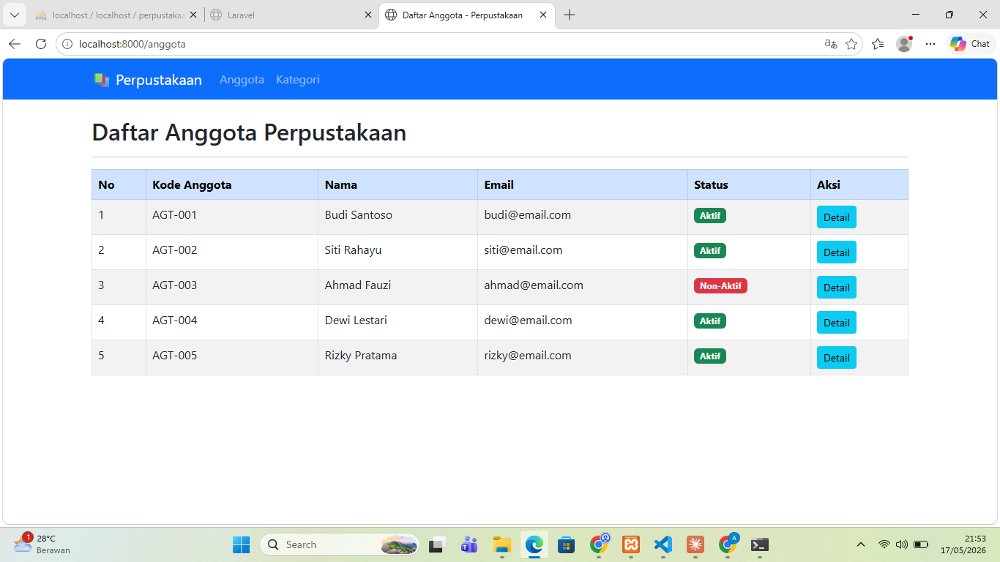
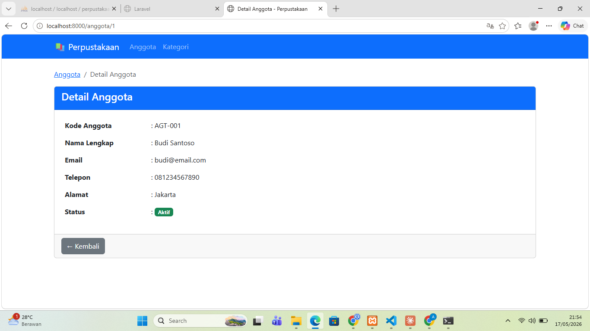
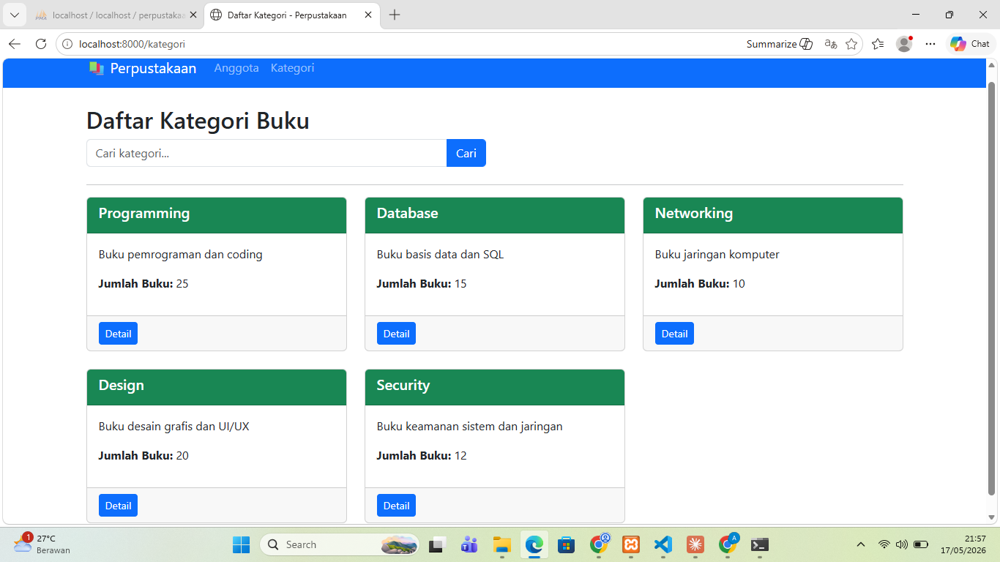
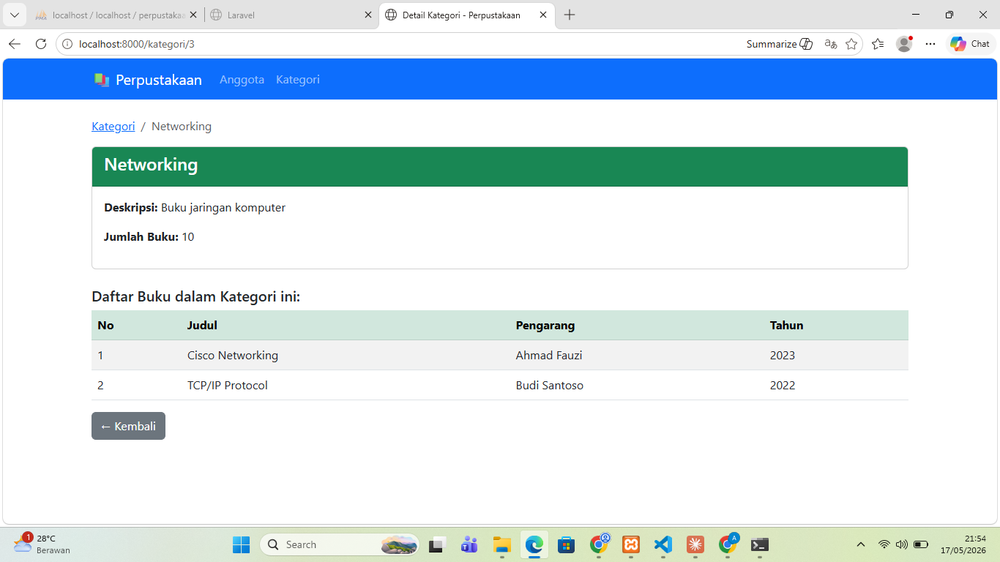
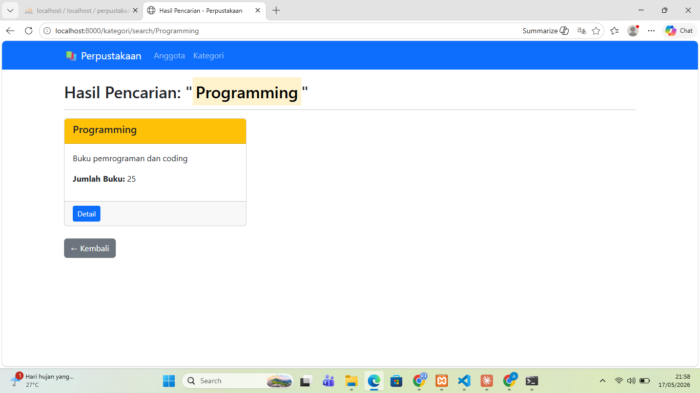

# Tugas Pertemuan 9 - Pengenalan Framework Laravel MVC

**Nama:** Ramonaa Aprilia Yuniar  
**Repository:** [https://github.com/ramonaapriliayuniar55/Tugas-Pertemuan-9-PENGENALAN-FRAMEWORK-LARAVEL-MVC](https://github.com/ramonaapriliayuniar55/Tugas-Pertemuan-9-PENGENALAN-FRAMEWORK-LARAVEL-MVC)

---

##  Tugas 1 - Routing dan View Anggota 

### Route yang dibuat:
| Method | URL | Keterangan |
|--------|-----|------------|
| GET | `/anggota` | Daftar semua anggota |
| GET | `/anggota/{id}` | Detail anggota |

### Screenshot

#### Tampilan Daftar Anggota (`/anggota`)

#### Detail Anggota (`/anggota/1`)

---

## Tugas 2 - Controller Kategori (60%)

### Controller: `KategoriController`
- `index()` - Menampilkan daftar kategori
- `show($id)` - Menampilkan detail kategori + daftar buku
- `search($keyword)` - Mencari kategori berdasarkan keyword

### Route yang dibuat:
| Method | URL | Controller | Keterangan |
|--------|-----|------------|------------|
| GET | `/kategori` | `KategoriController@index` | Daftar kategori |
| GET | `/kategori/{id}` | `KategoriController@show` | Detail kategori |
| GET | `/kategori/search/{keyword}` | `KategoriController@search` | Cari kategori |

### Screenshot

#### Tampilan Daftar Kategori (`/kategori`)

#### Detail Kategori (`/kategori/1`)

#### Hasil Search (`/kategori/search/programming`)

---

